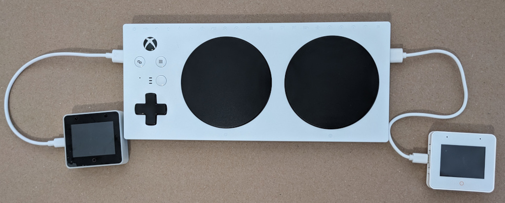
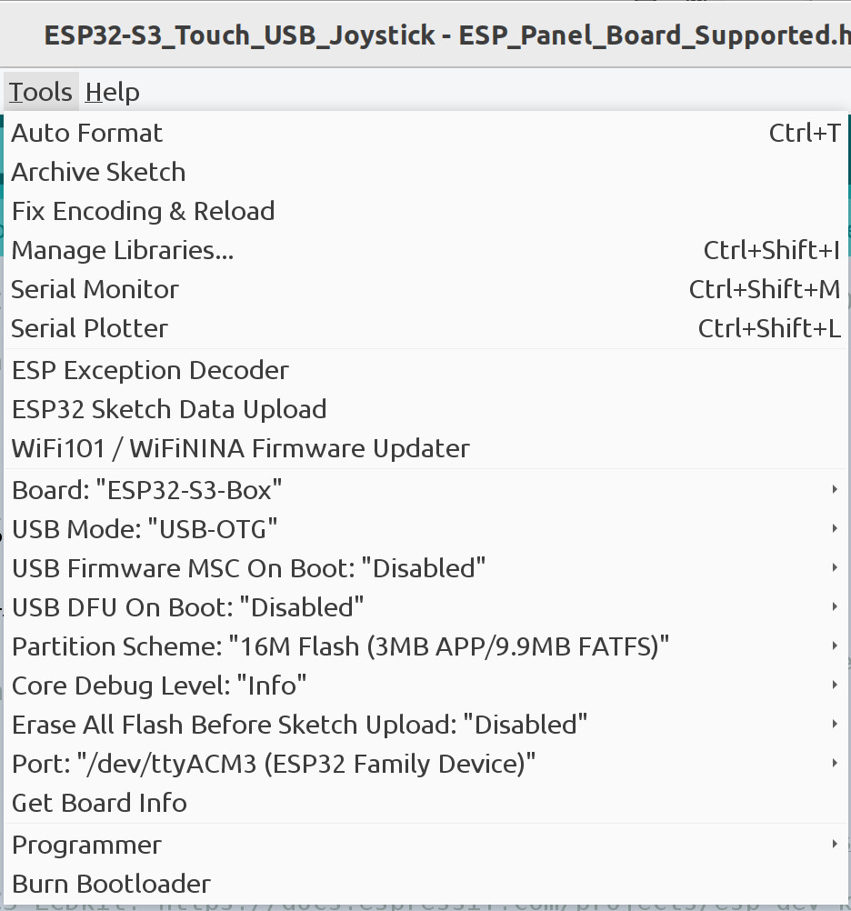

# ESP32-S3 Capacitive Touch USB Joystick

The USB joystick can be used with the Xbox Adaptive Controller (XAC) as well as
Windows, MacOS, Linux, and other devices that accept USB HID joysticks.

The LCD display is not used and the backlight is turned off to reduce power
consumption. The XAC provides at most 100 mA on its USB host ports unless it
is plugged into a 5V 2A power supply. Turning the backlight off ensures the
ESP32 box draws less than 100 mA.

Tested using Arduino IDE 1.8.19 and
[Espressif ESP32-BOX-S3-3](https://github.com/espressif/esp-box/blob/master/docs/hardware_overview/esp32_s3_box_3/hardware_overview_for_box_3.md)
and
[the original Espressif ESP32-BOX-S3](https://github.com/espressif/esp-box/blob/master/docs/hardware_overview/esp32_s3_box/hardware_overview_for_box.md)

The original ESP32 S3 Box has been discontinued.

There is a similar project for the M5Stack Dial (also known as M5Dial) at
https://github.com/esp32beans/M5Stack_Touch_USB_Joystick.

## Dependencies

The install the following libraries using the Arduino IDE Library manager.

* "ESP32_IO_Expander" by espressif

Install the following library by downloading a .ZIP file then install it using
the Arduino IDE "Add .ZIP Library" option. This is the same as the
"ESP32_Display_Panel" library by espressif but patched to default the backlight
off. If the original "ESP32 Display Panel" library is used, the backlight
defaults on so the ESP32 S3 Box will not work on the XAC because the backlight
draws too much current.

* https://github.com/esp32beans/ESP32_Display_Panel_Backlight_Off

Note the ESP_Display_Panel library must be configured to match the ESP32-S3 Box
(original or -3). See https://github.com/esp-arduino-libs/ESP32_Display_Panel#for-supported-board
for instructions.

The USB joystick library is from https://github.com/esp32beans/ESP32_flight_stick.
Download the library as a ZIP file then install it using the Arduino IDE "Add .ZIP Library" option.

## Arduino IDE Build options for ESP32-S3 Box and ESP32-S3 Box 3

